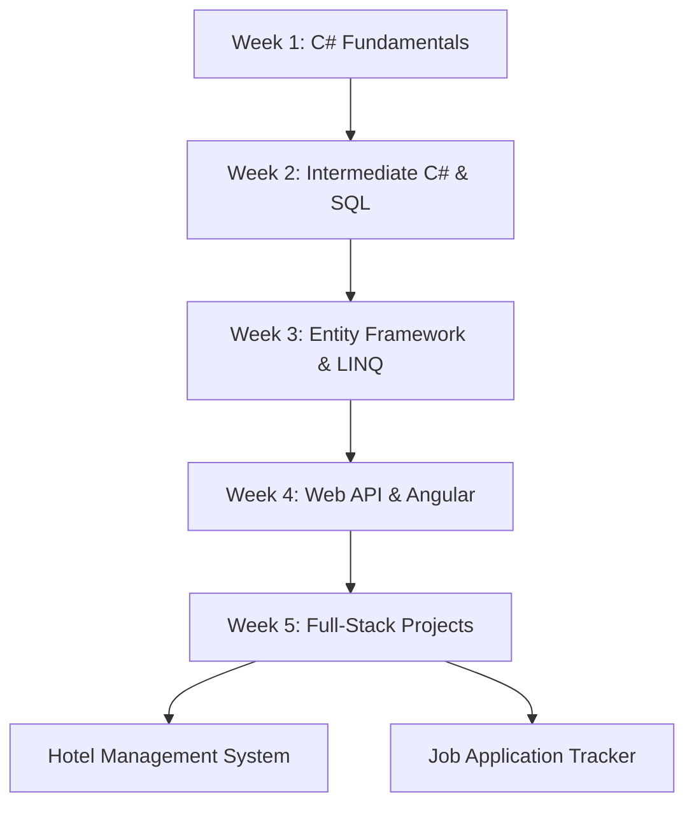

# 🚀 GeekyWolf Internship Portfolio

A comprehensive collection of **assignments, projects, and learning exercises** completed during my internship at **GeekyWolf**. This repository showcases weekly progress in full-stack development using **.NET, C#, SQL, Angular, TypeScript**, and web technologies.

🎓 **Internship Duration:** [Add your dates]  
🏢 **Company:** GeekyWolf  
👨‍💻 **Intern:** Dilshad P

---

## 📚 Repository Overview

This repository is organized by weeks, containing assignments and projects that demonstrate progressive learning in software development, from fundamentals to building complete full-stack applications.

### 📂 Repository Structure

```
GeekyWolf_Internship/
│
├── week01/                      # Week 1: Introduction & Fundamentals
│   └── [Assignments & exercises]
│
├── week02/                      # Week 2: Core Concepts
│   └── [Assignments & exercises]
│
├── week03/                      # Week 3: Intermediate Topics
│   └── [Assignments & exercises]
│
├── week04/                      # Week 4: Advanced Concepts
│   └── [Assignments & exercises]
│
├── week05/                      # Week 5: Final Projects
│   └── [Assignments & exercises]
│
└── README.md                    # This file
```

---

## 🛠️ Technologies & Skills Learned

### Backend Development
- **C# (.NET)** - 83.1%
- **ASP.NET Core Web API**
- **Entity Framework Core**
- **RESTful API Design**
- **LINQ & Lambda Expressions**

### Database
- **T-SQL / SQL Server** - 10.7%
- **Database Design & Normalization**
- **Stored Procedures & Functions**
- **Migrations & Seeding**

### Frontend Development
- **TypeScript** - 2.0%
- **JavaScript** - 2.1%
- **Angular Framework**
- **HTML5** - 1.5%
- **CSS3** - 0.3%
- **SCSS** - 0.3%

### Tools & Practices
- **Git & GitHub**
- **Visual Studio / VS Code**
- **Postman (API Testing)**
- **SQL Server Management Studio**
- **Agile Methodologies**

---

## 📅 Weekly Breakdown

### 📖 Week 01: Foundations
**Focus Areas:**
- C# Basics & Syntax
- Object-Oriented Programming Concepts
- Data Types, Variables & Operators
- Control Flow & Loops
- Methods & Functions

**Key Learnings:**
- Understanding .NET ecosystem
- Writing clean, readable code
- Basic problem-solving skills

---

### 📖 Week 02: Intermediate C# & SQL
**Focus Areas:**
- Collections (Lists, Arrays, Dictionaries)
- Exception Handling
- File I/O Operations
- Introduction to SQL
- Basic CRUD Operations

**Key Learnings:**
- Working with data structures
- Database fundamentals
- Writing SQL queries

---

### 📖 Week 03: Advanced C# & Entity Framework
**Focus Areas:**
- LINQ Queries
- Entity Framework Core Basics
- Code-First Approach
- Database Migrations
- Repository Pattern

**Key Learnings:**
- ORM concepts
- Database migrations
- Data access patterns

---

### 📖 Week 04: Web API & Frontend Basics
**Focus Areas:**
- ASP.NET Core Web API
- RESTful API Design
- Angular Introduction
- TypeScript Fundamentals
- HTTP Client & Services

**Key Learnings:**
- Building scalable APIs
- Frontend-backend integration
- Component-based architecture

---

### 📖 Week 05: Full-Stack Projects
**Focus Areas:**
- Complete application development
- Authentication & Authorization
- Deployment strategies
- Best practices & code review

**Major Projects:**
- 🏨 [Hotel Management System](https://github.com/dilshadparambil/HotelManagement)
- 💼 [Job Application Tracker](https://github.com/dilshadparambil/JobApplicationTracker)

**Key Learnings:**
- End-to-end application development
- Project planning & execution
- Code quality & documentation

---

## 🎯 Major Projects Developed

### 1. 🏨 Hotel Management System
**Mini Project 1** - Full-stack hotel booking and management system

**Features:**
- Room management (CRUD operations)
- Booking system with date tracking
- Guest management
- Real-time availability checking

**Tech Stack:** Angular + .NET Core + SQL Server

[View Repository →](https://github.com/dilshadparambil/HotelManagement)

---

### 2. 💼 Job Application Tracker
**Mini Project 2** - Track job applications throughout the job search process

**Features:**
- Application management (CRUD)
- Status tracking (Applied, Interview, Offer, etc.)
- Company & position details
- Search & filtering capabilities

**Tech Stack:** Angular + .NET Core + Entity Framework

[View Repository →](https://github.com/dilshadparambil/JobApplicationTracker)

---

## 💡 Key Skills Developed

### Technical Skills
✅ Full-stack web development  
✅ RESTful API design & implementation  
✅ Database design & optimization  
✅ Frontend framework (Angular)  
✅ Version control with Git  
✅ Problem-solving & debugging  

### Soft Skills
✅ Time management  
✅ Self-directed learning  
✅ Code documentation  
✅ Project planning  
✅ Communication & collaboration  
✅ Attention to detail  

---

## 📊 Statistics


**Total Commits:** 6  
**Weeks Completed:** 5  
**Major Projects:** 2  
**Languages Used:** 7  

---

## 🚀 How to Explore This Repository

### Option 1: Browse Weekly Folders
Navigate through each `week01` to `week05` folder to see progressive learning:

```bash
git clone https://github.com/dilshadparambil/GeekyWolf_Internship.git
cd GeekyWolf_Internship
```

### Option 2: View Specific Weeks
```bash
# Week 1
cd week01

# Week 2
cd week02

# Continue for other weeks...
```

### Option 3: Run Individual Projects
Each week's folder may contain runnable projects. Check individual README files within each week folder for specific instructions.

---

## 🎓 Learning Path



---

## 📝 Assignments Overview

### Week-by-Week Assignments

#### Week 01
- Basic C# syntax exercises
- OOP concept implementations
- Simple console applications

#### Week 02
- Collection manipulation tasks
- File handling exercises
- SQL query challenges

#### Week 03
- LINQ query exercises
- Entity Framework implementations
- Database migration tasks

#### Week 04
- API endpoint creation
- Angular component development
- Integration exercises

#### Week 05
- Complete project development
- Feature implementation
- Testing & debugging

---

## 🛠️ Setup & Installation

### Prerequisites
- **.NET SDK** (6.0 or higher)
- **SQL Server** or **SQL Server Express**
- **Node.js & npm** (for Angular projects)
- **Angular CLI** (`npm install -g @angular/cli`)
- **Visual Studio** or **VS Code**
- **Git**

### Clone the Repository
```bash
git clone https://github.com/dilshadparambil/GeekyWolf_Internship.git
cd GeekyWolf_Internship
```

### Navigate to Specific Week
```bash
cd week01  # or week02, week03, etc.
```

### For .NET Projects
```bash
dotnet restore
dotnet build
dotnet run
```

### For Angular Projects
```bash
npm install
ng serve
```

---

## 📈 Progress Timeline

```
Week 1  ████████████████████ 100% - C# Fundamentals
Week 2  ████████████████████ 100% - Intermediate Concepts
Week 3  ████████████████████ 100% - EF Core & LINQ
Week 4  ████████████████████ 100% - Web API & Angular
Week 5  ████████████████████ 100% - Major Projects
```

**Overall Completion:** 100% ✅

---

## 🏆 Achievements & Milestones

- ✅ Completed 5 weeks of intensive training
- ✅ Built 2 full-stack applications from scratch
- ✅ Mastered C# and .NET Core fundamentals
- ✅ Learned Angular framework
- ✅ Implemented RESTful APIs
- ✅ Worked with Entity Framework & SQL
- ✅ Version control with Git & GitHub
- ✅ Applied best practices in software development

---

## 💼 Internship Experience

### What I Learned

**Technical Growth:**
- Transitioned from beginner to building complete applications
- Understanding of full-stack architecture
- Ability to debug and solve complex problems
- Writing clean, maintainable code

**Professional Development:**
- Working with real-world project requirements
- Meeting deadlines and managing time effectively
- Seeking feedback and implementing improvements
- Documenting code and processes

**Industry Exposure:**
- Modern software development practices
- Agile workflow understanding
- Code review processes
- Team collaboration techniques

---

## 🎯 Post-Internship Goals

- [ ] Deploy projects to production (Azure/AWS)
- [ ] Add authentication to both projects
- [ ] Implement unit & integration tests
- [ ] Create CI/CD pipelines
- [ ] Add more advanced features
- [ ] Contribute to open-source projects
- [ ] Continue learning advanced .NET concepts
- [ ] Master advanced Angular patterns

---

## 📚 Resources & References

### Official Documentation
- [Microsoft .NET Documentation](https://docs.microsoft.com/en-us/dotnet/)
- [ASP.NET Core Documentation](https://docs.microsoft.com/en-us/aspnet/core/)
- [Entity Framework Core](https://docs.microsoft.com/en-us/ef/core/)
- [Angular Documentation](https://angular.io/docs)
- [TypeScript Handbook](https://www.typescriptlang.org/docs/)

### Learning Platforms
- [Microsoft Learn](https://learn.microsoft.com/)
- [Pluralsight](https://www.pluralsight.com/)
- [Stack Overflow](https://stackoverflow.com/)

### Tools
- [Visual Studio](https://visualstudio.microsoft.com/)
- [VS Code](https://code.visualstudio.com/)
- [Postman](https://www.postman.com/)
- [SQL Server Management Studio](https://docs.microsoft.com/en-us/sql/ssms/)

---

## 🤝 Acknowledgments

### Special Thanks To:

**GeekyWolf Team**
- For providing this incredible learning opportunity
- For mentorship and guidance throughout the internship
- For creating challenging and educational assignments
- For fostering a supportive learning environment

**Mentors & Instructors**
- For patience in explaining complex concepts
- For constructive feedback on code
- For sharing industry best practices
- For encouraging continuous learning

---

## 📞 Connect With Me

**Dilshad P**

- 💼 [LinkedIn](https://linkedin.com/in/dilshadparambil) *(Add your profile)*
- 🐙 [GitHub](https://github.com/dilshadparambil)
- 📧 [Email](mailto:your.email@example.com) *(Add your email)*
- 🌐 [Portfolio](https://yourportfolio.com) *(Add if available)*

---

## 📜 License

This project is created for educational purposes during the GeekyWolf internship.  
Feel free to explore and learn from the code!

---

## ⭐ Show Your Support

If you found this internship portfolio helpful or inspiring:

- ⭐ Star this repository
- 🍴 Fork it to explore the code
- 📢 Share it with others
- 💬 Provide feedback or suggestions

---

## 📝 Notes

### For Recruiters & Employers

This repository demonstrates:
- **Rapid Learning Ability:** Progressed from basics to full-stack development in 5 weeks
- **Practical Skills:** Built real-world applications with modern technologies
- **Code Quality:** Clean, well-documented, and maintainable code
- **Problem Solving:** Successfully completed assignments and projects
- **Continuous Improvement:** Actively learning and implementing best practices

### For Fellow Learners

Feel free to:
- Explore the code and learn from it
- Use it as a reference for your own learning
- Ask questions by opening issues
- Suggest improvements via pull requests

---

## 📂 Related Repositories

### Major Projects:
- 🏨 [Hotel Management System](https://github.com/dilshadparambil/HotelManagement) - Mini Project 1
- 💼 [Job Application Tracker](https://github.com/dilshadparambil/JobApplicationTracker) - Mini Project 2

### Other Work:
- 📝 [Personal Blog (Flask)](https://github.com/dilshadparambil/Python_Personal.blog) - Python project
- *Add other relevant repositories*

---

## 🎓 Certificate

*[Add certificate image or link once received]*

---

## 📊 Weekly Contribution Graph

```
Week 1: ⭐⭐⭐⭐⭐ [Fundamentals mastered]
Week 2: ⭐⭐⭐⭐⭐ [Database skills acquired]
Week 3: ⭐⭐⭐⭐⭐ [EF Core proficiency]
Week 4: ⭐⭐⭐⭐⭐ [API & Angular learned]
Week 5: ⭐⭐⭐⭐⭐ [Full-stack projects completed]
```

---

## 🌟 Testimonial

> *"Dilshad showed exceptional dedication and rapid learning throughout the internship. He successfully completed all assignments and delivered two impressive full-stack projects."*  
> — **GeekyWolf Mentor** *(Add actual testimonial if available)*

---

## 🎉 Final Thoughts

This internship at GeekyWolf has been an incredible journey from learning programming fundamentals to building complete full-stack applications. Every week brought new challenges and opportunities to grow as a developer.

**Key Takeaway:** Consistent practice, asking questions, and building real projects are the best ways to learn software development.

Thank you to GeekyWolf for this amazing opportunity! 🙏

---

**Last Updated:** February 2026  
**Status:** Internship Completed ✅  
**Next Steps:** Continuing to enhance skills and build more projects!

---

<div align="center">

### 🚀 Built with passion during my GeekyWolf Internship

**Made with ❤️ by [Dilshad P](https://github.com/dilshadparambil)**

</div>
